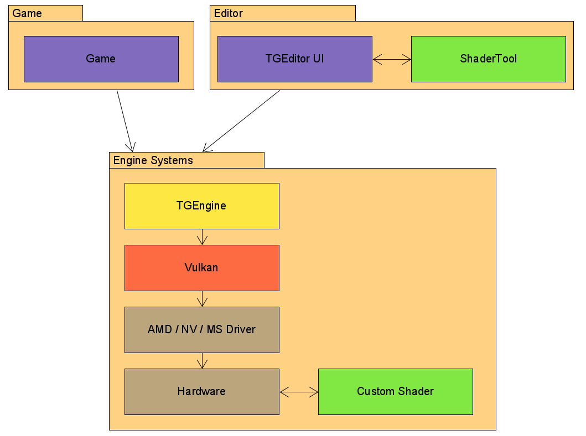

# System Scope and Context

The Engine is based upon the Vulkan API. The Vulkan API's primary purpose is to
provide platform and vendor independent GPU driver access. The engines shader
programs, as well as every call to the GPU, go through the Vulkan API and the
driver. Any game build by the engine, as well as the editor, is built upon the
engine systems. Our tool system (ShaderTool) will be accessed through the Editor
UI or per command line by an other programmer.

