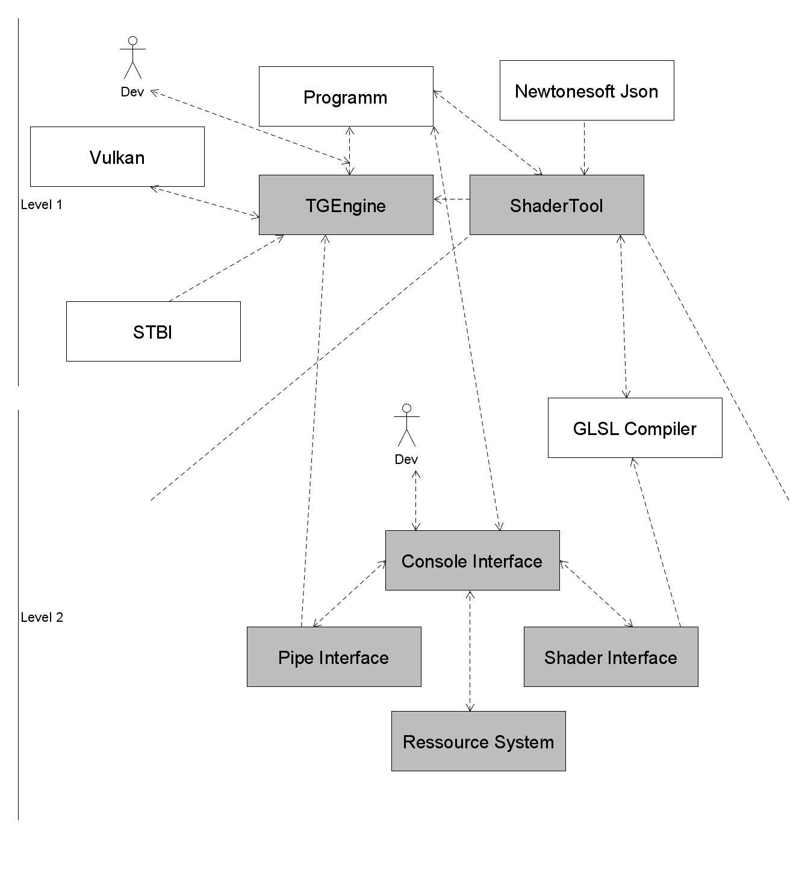
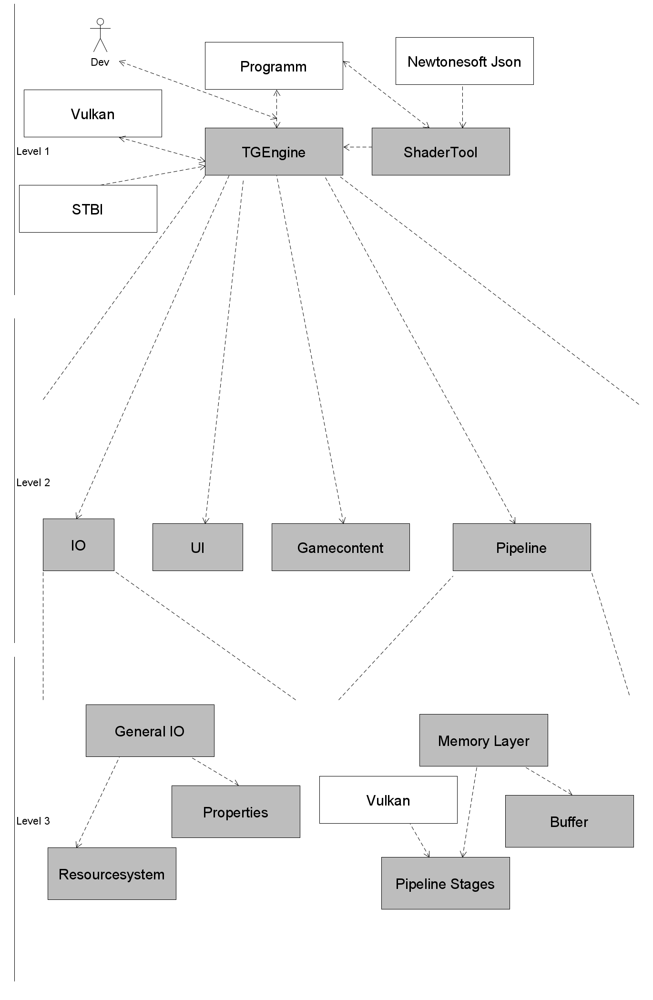

# Building Block View

## ShaderTool

The primary purpose of the ShaderTool was to compile shader into the Engine. The tool started to grow because of its console interface, which makes it ideal for tooling.

| Subsystem         | Description                                                                  |
| ----------------- | ---------------------------------------------------------------------------- |
| Console Interface | Allow s for console input and forwards the arguments to the given subsystem  |
| Shader Interface  | This system compiles shader and embeds them into the engine                  |
| Pipe Interface    | Analyzes the compiled shaders and creates the according pipeline information |
| Resource System   | This system administrates all game resources.                                |

## TGEngine

The decomposition has historical reasons

| Subsystem       | Description                                                                                                                        |
| --------------- | ---------------------------------------------------------------------------------------------------------------------------------- |
| IO              | For general in and output managment                                                                                                |
| UI              | Contains all user interface components                                                                                             |
| Gamecontent     | Everything that can be put into the game (Actors, Lights  ...)                                                                     |
| Pipeline        | This is the heart of the engine and contains everything needed to create a Vulkan Application with the according featureset needed |
| General IO      | Platform independency layer for file handling                                                                                      |
| Properties      | A small XML reader with a given schema                                                                                             |
| Resourcesystem  | the counterpart to the ShaderTools resource system, except this one only reads the resources                                       |
| Memory Layer    | The own memory management for the GPU, as well as the system memory                                                                |
| Pipeline Stages | Consists of all passes and commands recorded to the GPU                                                                            |
| Buffer          | All the static memory buffering on the GPU                                                                                         |
